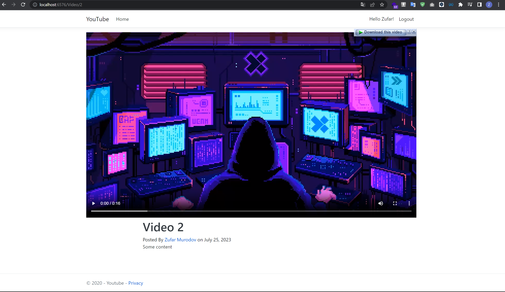

# YouTube-ASP.NET

YouTube-ASP.NET is a simple ASP.NET Core MVC application that allows you to create your channel and upload videos like youtube.

## Features

- Login and register.
- Admin panel.
- Managing profile.
- Managing videos.
- Search for videos based on title.
- Display a list of videos with thumbnails, titles, and channel information.
- View detailed information about a selected video, including likes, dislikes, and comments.
- Simple and intuitive user interface.


## Some screenshots


Home page


Login page


Register page


Admin panel


Edit profile page


View profile page


Upload video page


View video page


Home page

Demo video:
https://github.com/zmurodov/YouTube-ASP.NET/assets/37672731/6fd3f358-c71d-461e-8013-0c023136120f


## Installation

To set up the project locally, follow these steps:

1. Clone the repository using the following command:

```bash
git clone https://github.com/zmurodov/YouTube-ASP.NET.git
```

1. Navigate to the project directory:

    ```bash
    cd YouTube-ASP.NET
2. Restore the required NuGet packages:
    
    ```bash
    dotnet restore
3. Build the solution:
    
    ```bash
    dotnet build
   
4. Run the project:
    
    ```bash
    dotnet run


## Usage
Open your web browser and navigate to the running application.

